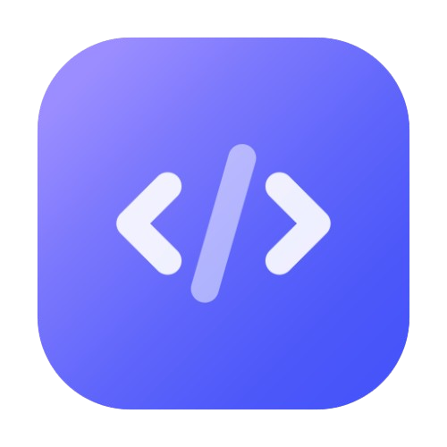

# Devmode

<p align="center">
  
</p>

**Devmode** keeps every project on your machine in one place, filed away neatly,
searchable by name, and grouped the way you actually work. No accounts, no API
tokens, nothing leaves your computer.

## Why Devmode

- **Never lose a repo again.** Everything you clone or create is tracked, so you
  always know what's on your disk and where.
- **A tidy projects folder, automatically.** Clones land in a consistent
  structure (`github.com/owner/repo`, or whatever layout you prefer) instead of
  wherever you happened to run the command.
- **Jump to any project instantly.** Search by name and open it, no more digging
  through nested folders or `cd`-ing around.
- **Group related projects into workspaces.** Bundle the repos for a client, a
  product, or a side project, then open the whole set in your editor at once,
  each workspace with its own editor and environment variables.
- **Non-destructive.** Workspaces are just labels. Your repos never move on disk
  to join one, and leaving a workspace never touches your files.
- **Works offline.** Every git operation runs locally. No GitHub or GitLab
  account required.

## Install

The command-line tool:

```bash
cargo install devmode      # installs `dm`
```

Optional extra interfaces:

```bash
cargo install dmtui        # full-screen terminal UI
cargo install dmui         # desktop app
```

The desktop app will also be available on Flathub.

## Quick start

```bash
# Clone a repo, Devmode files it away and remembers it
dm clone https://github.com/owner/repo.git

# See everything you're tracking, or find one by name
dm ls
dm find repo

# Make a workspace and open all its repos in one go
dm workspace create client-x --editor "code -n"
dm workspace add client-x repo
dm workspace switch client-x
```

Run `dm --help` or `dm <command> --help` for the full reference, and
`dm completions <shell>` to set up tab completion.

## Three ways to use it

Pick whichever fits the moment, they all read and write the same data, so you
can switch freely.

| | Best for |
|---|---|
| **`dm`** | quick commands and scripting |
| **`dmtui`** | browsing and editing without leaving the terminal |
| **`dmui`** | a desktop window for bulk work and discovering repos already on disk |

The desktop app adds a **Discovery** view that scans a folder for repos you
haven't tracked yet and lets you add them in batches, and flags tracked repos
that have gone missing or whose remotes have changed. It follows your system
light/dark theme.

## Proposals

Have an idea for a feature? Open an
[issue](https://github.com/edfloreshz/devmode/issues).
